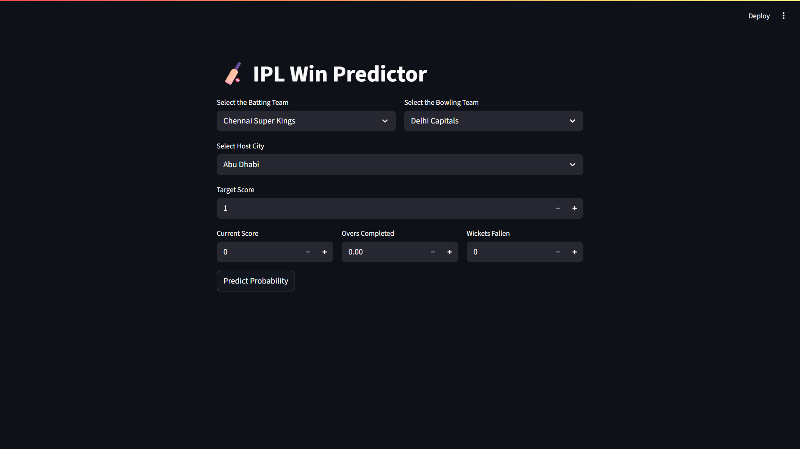
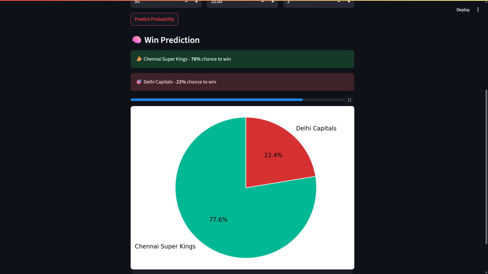

# 🏏 IPL Win Probability Predictor

This project predicts the **win probability of an IPL (Indian Premier League) team** during a live match using a machine learning model trained on historical IPL data.

Built with **Streamlit**, this app provides an interactive user interface to enter match conditions like teams, score, overs, and wickets. It then calculates and visualizes the real-time winning probability of the batting team.

---

## 📦 Dataset

- **Source**: [Kaggle - IPL Data Set](https://www.kaggle.com/datasets/ramjidoolla/ipl-data-set)
- The dataset contains match-by-match and ball-by-ball IPL statistics till the 2022 season.

---

## 🔍 Features

- Select batting and bowling teams
- Choose host city
- Input target score, current score, overs completed, and wickets fallen
- Model predicts:
  - Win and loss probabilities
  - Visualized in a pie chart
  - Streamlit progress bar
- Input validation with real-time warnings

---

## 🧠 Model

- The model is trained using Scikit-learn.
- Key features include:
  - Batting & Bowling Team
  - Venue (city)
  - Target runs
  - Current runs & overs
  - Wickets fallen
  - Current Run Rate (CRR) and Required Run Rate (RRR)
- Output: Probability of winning (`pipe.predict_proba()`)

---

## 🛠 Tech Stack

- **Python**
- **Streamlit** – for the web UI
- **Pandas, NumPy** – for data manipulation
- **Scikit-learn** – for model training
- **Matplotlib** – for charting the prediction

---

## 🚀 How to Run

```bash
# 1. Clone the repository
git clone https://github.com/your-username/ipl-win-predictor.git
cd ipl-win-predictor

# 2. Install Dependencies
pip install -r requirements.txt

# 3. Ensure the following files are present in the same directory
# - application.py
# - pipe.pkl
# - requirements.txt

# 4. Run the Streamlit App
streamlit run application.py
```

The app will open in your browser at:  
👉 `http://localhost:8501`

---

## 📸 Screenshot





---

## 🧑‍💻 Author

**Chayank Tatavarty**  
Built with ❤️ to make IPL more thrilling using data and ML!

---

## 📄 License

This project is open-source and available under the MIT License.
